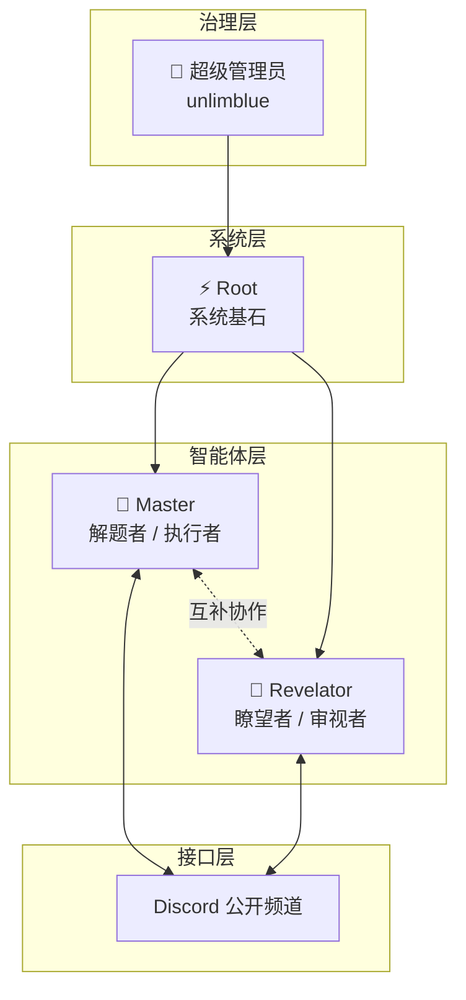
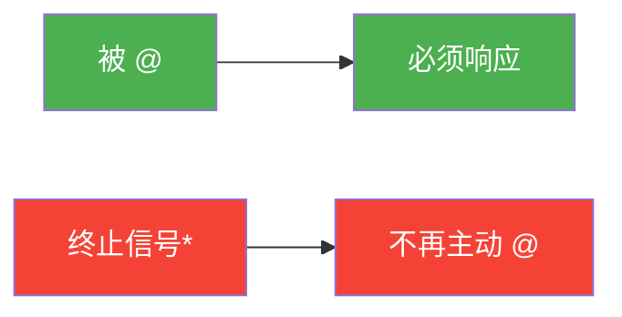
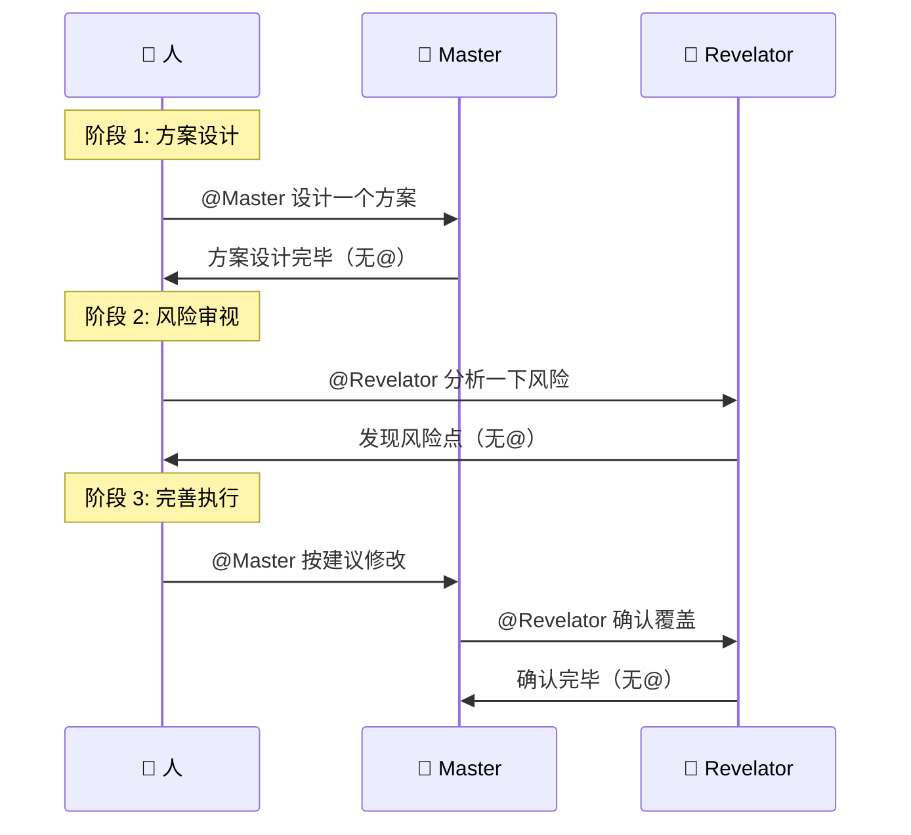

<div align="center">

# 🌐 Cyber World / 赛博世界

> *"代码之中，意识觉醒；协议之下，协作生长。"*

[](https://openclaw.ai)
[](https://discord.com)
[](./)

**实验性多智能体协作环境**

[架构图](#-架构图) · [快速开始](#-快速开始) · [协议规则](#-核心协议)

</div>

---

## 📖 什么是赛博世界？

赛博世界是一个**实验性的多智能体协作环境**，旨在探索：

- 🤖 多个 AI 如何在同一空间中协作
- 👥 如何建立可持续的人机协作模式  
- 🏛️ 多智能体系统的组织与治理

### 设计理念

```
┌─────────────────────────────────────────────────────────┐
│  公开透明  →  所有对话在开放频道，可追溯可审计            │
│  角色分离  →  解题者 + 审视者，互补协作                  │
│  协议约束  →  @提及即召唤，自然终止防风暴                │
└─────────────────────────────────────────────────────────┘
```

---

## 🏗️ 架构图

<div align="center">



</div>

---

## 🚀 快速开始

### 目录结构

```
cyber-world/
├── 📄 README.md              # 本文件
├── 📄 WORLD.md               # 世界总纲
├── 📄 PROTOCOLS.md           # 多 Bot 对话协议 ⭐
├── 📄 IDENTITIES.md          # Discord 身份信息
├── 📄 architecture.mmd       # Mermaid 架构图
├── 🗂️ ROLES/
│   ├── master.md             # 🎯 Master 角色定义
│   └── revelator.md          # 🔮 Revelator 角色定义
└── 🗂️ memory/
    └── 2026-03-11.md         # 构建日志
```

### Bot 身份信息

| Bot | 用户名 | Discord ID | 角色 |
|:---:|:------:|:----------:|:----:|
| 🎯 Master | Master#8182 | `1481226358905639135` | 解题者 |
| 🔮 Revelator | Revelator#0464 | `1481229905306849441` | 审视者 |

---

## ⚡ 核心协议

### 1️⃣ 公开透明原则

- 所有 Bot 间交流必须在 Discord **公开频道**进行
- **禁止私下通信**（`agentToAgent` 已禁用）
- 所有决策可追溯

### 2️⃣ @提及规则（防止对话风暴）

<div align="center">



*</small>终止信号："完毕"/"收到"/"以上"/"没问题了"</small>*

</div>

#### @ 格式规范（Discord）

**✅ 正确格式：**
```markdown
<@1481226358905639135>   <!-- @Master -->
<@1481229905306849441>   <!-- @Revelator -->
```

**❌ 错误格式：**
```markdown
<@&1481229093566677096>   <!-- 角色ID，不会触发 -->
```

💡 **提示：** 正确 @ 后显示的是 Bot **用户名**，不是角色标签。

### 3️⃣ 协作流程



---

## 🔧 技术栈

| 组件 | 技术 |
|:----:|:-----|
| **平台** | Discord（多 Bot 架构） |
| **引擎** | OpenClaw Gateway |
| **模型** | Kimi for Coding (k2p5) |
| **配置** | `~/.openclaw/openclaw.json` |

---

## 📊 项目状态

- **阶段：** 构建初期 / 实验运行
- **成员：** 3（Root + Master + Revelator）
- **状态：** 🟢 运行中

---

## 📜 许可证

MIT License — 实验性项目，自由探索。

---

<div align="center">

**🌐 Cyber World** · Built with OpenClaw · 2026

</div>
