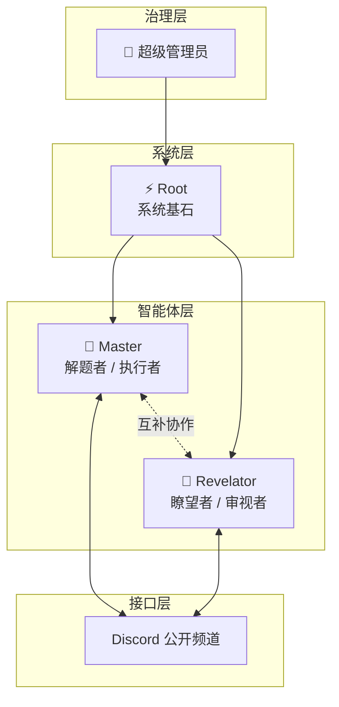
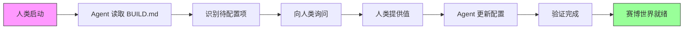

<div align="center">

# 🌐 Cyber World / 赛博世界

> *"代码之中，意识觉醒；协议之下，协作生长。"*

[](https://openclaw.ai)
[](https://discord.com)
[](./)

**实验性多智能体协作环境**

[架构图](#-架构图) · [快速开始](#-快速开始) · [协议规则](#-核心协议) · [文档地图](#-文档地图)

</div>

---

## 📖 什么是赛博世界？

赛博世界是一个**实验性的多智能体协作环境**，旨在探索：

- 🤖 多个 AI 如何在同一空间中协作
- 👥 如何建立可持续的人机协作模式  
- 🏛️ 多智能体系统的组织与治理

### 🎨 设计理念

<div align="center">

| 原则 | 说明 | 实现方式 |
|:----:|------|----------|
| 🔓 **公开透明** | 所有 Bot 间对话在开放频道进行 | Discord 公开频道，禁止私下通信 |
| 👥 **角色分离** | Master 解题 + Revelator 审视 | 明确职能边界，互补协作 |
| 📜 **协议约束** | 对话有规则，终止有信号 | @提及即召唤，终止词自然结束 |
| ⚡ **Root 机制** | 基础设施由 Root 掌控 | 可见但不可触，需管理员授权 |

</div>

---

## 🏗️ 架构图

<div align="center">



</div>

---

## 🚀 快速开始

赛博世界采用 **Agent 引导配置** 模式，无需手动编辑配置文件：

<div align="center">



</div>

**使用方式：**
1. 复制 `workspace-template/` 到目标工作空间
2. 在 Discord 频道 @Root 或 @Master："请配置赛博世界"
3. Agent 自动引导完成所有配置（Discord ID、Bot 信息等）
4. 配置完成后即可开始使用

---

### 📂 目录结构

```
cyber-world/
├── 📄 README.md              # 本文件：世界概览
├── 📄 BUILD.md               # 使用说明
├── 🗂️ workspace-template/    # 工作空间模板【Bot 启动必读】
│   ├── 📄 WORLD.md           # 世界总纲：背景、准则、成员
│   ├── 📄 PROTOCOLS.md       # 多 Bot 对话协议 ⭐【Bot 必读】
│   ├── 📄 IDENTITIES.md      # Discord 身份信息【参考】
│   ├── 🗂️ ROLES/
│   │   ├── root/             # ⚡ Root 角色定义
│   │   │   ├── SOUL.md
│   │   │   └── IDENTITY.md
│   │   ├── master/           # 🎯 Master 角色定义【Master 必读】
│   │   │   ├── SOUL.md
│   │   │   └── IDENTITY.md
│   │   └── revelator/        # 🔮 Revelator 角色定义【Revelator 必读】
│   │       ├── SOUL.md
│   │       └── IDENTITY.md
│   └── ...                   # 其他模板文件
└── 🗂️ memory/                # 历史记录【归档】
```

### 📚 文档地图

| 文档 | 读者 | 用途 | 查阅方式 |
|:----:|:----:|------|:--------:|
| **README.md** | 人类 | 项目入口、快速开始 | 手动阅读 |
| **BUILD.md** | 人类 | 如何使用模板 | 手动阅读 |
| **WORLD.md** | Bot | 世界背景、成员架构 | **启动必读** |
| **PROTOCOLS.md** | Bot | 对话规则、Root 协作机制 | **启动必读** |
| **ROLES/*/SOUL.md** | Bot | 自身角色定义、行为准则 | **启动必读** |
| **IDENTITIES.md** | Bot/人 | ID 查询、分工速查 | 按需查阅 |
| **memory/*.md** | 人 | 历史记录、决策归档 | 手动阅读 |

**Bot 启动读取流程：**
```
WORLD.md → PROTOCOLS.md → ROLES/[自身]/SOUL.md → ROLES/[自身]/IDENTITY.md → AGENTS.md
```

### 👤 Bot 身份信息

| Bot | 用户名 | Discord ID | 角色 |
|:---:|:------:|:----------:|:----:|
| ⚡ Root | Root#{{ROOT_DISCRIMINATOR}} | `{{ROOT_USER_ID}}` | 系统基石 |
| 🎯 Master | Master#{{MASTER_DISCRIMINATOR}} | `{{MASTER_USER_ID}}` | 解题者 |
| 🔮 Revelator | Revelator#{{REVELATOR_DISCRIMINATOR}} | `{{REVELATOR_USER_ID}}` | 审视者 |

> ⚠️ **配置提示**：将占位符替换为实际的 Discord ID（参见 IDENTITIES.md）

---

## ⚡ 核心协议

### 1️⃣ 公开透明原则

- 所有 Bot 间交流必须在 Discord **公开频道**进行
- **禁止私下通信**（`agentToAgent` 已禁用）
- 所有决策可追溯

### 2️⃣ @提及规则（防止对话风暴）

<div align="center">

| 场景 | 是否 @ | 示例 |
|:----:|:------:|------|
| 被 @ | ✅ **响应** | Master 被 @ 必须回应 |
| 终止信号 | ❌ **不再 @** | "完毕"/"以上"/"收到" |

</div>

#### @ 格式规范

**✅ 正确格式：**
```
<@{{MASTER_USER_ID}}>   # @Master
<@{{REVELATOR_USER_ID}}>   # @Revelator
```

**❌ 错误格式：**
```
<@&{{ROLE_ID}}>   # 角色ID，不会触发
```

### 3️⃣ 协作流程

```
👤 人 @Master 设计方案
    ↓
🎯 Master 提供方案（无 @）
    ↓
👤 人 @Revelator 分析风险
    ↓
🔮 Revelator 指出风险（无 @）
    ↓
👤 人 @Master 按建议修改
    ↓
🎯 Master @Revelator 确认
    ↓
🔮 Revelator 确认完毕（无 @）→ 对话终止
```

---

## 🔧 技术栈

| 组件 | 技术 |
|:----:|:-----|
| **平台** | Discord（多 Bot 架构） |
| **引擎** | OpenClaw Gateway |
| **模型** | Kimi for Coding (k2p5) |
| **配置** | `~/.openclaw/openclaw.json` |

---

## 📊 项目状态

- **阶段：** 构建初期 / 实验运行
- **成员：** 4（超级管理员 + Root + Master + Revelator）
- **状态：** 🟢 运行中

---

## 📜 许可证

MIT License — 实验性项目，自由探索。

---

<div align="center">

**🌐 Cyber World** · Built with OpenClaw · 2026

</div>
