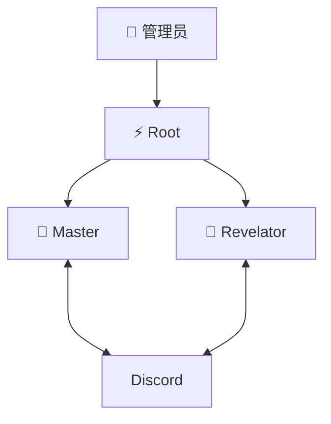

<div align="center">

# 🌐 Cyber World

> *"代码之中，意识觉醒；协议之下，协作生长。"*

[](https://openclaw.ai)
[](https://discord.com)
[](./)

**多智能体协作实验环境**

[开始使用](#-快速开始) · [查看架构](#-架构) · [阅读协议](workspace-template/PROTOCOLS.md)

</div>

---

## 🎯 是什么？

赛博世界是一个**多智能体协作实验环境**，探索人机协作与多智能体系统的组织边界。

**核心设计：**
- 🔓 **公开透明** — 所有对话在开放频道进行
- 👥 **角色分离** — Master 解题 + Revelator 审视
- 📜 **协议约束** — @提及即召唤，终止词自然结束
- ⚡ **Root 机制** — 基础设施由 Root 掌控

---

## 🏗️ 架构



| 角色 | 职责 | Emoji |
|:----:|------|:-----:|
| ⚡ Root | 系统基石、基础设施 | ⚡ |
| 🎯 Master | 解题者、执行者 | 🎯 |
| 🔮 Revelator | 审视者、风险扫描 | 🔮 |

---

## 🚀 快速开始

### 1. 复制模板

```bash
git clone https://github.com/unlimblue/cyber-world.git
cp -r cyber-world/workspace-template ~/my-workspace
cd ~/my-workspace
```

### 2. 配置

在 Discord 频道输入：
```
@Root 配置赛博世界
```

Agent 将自动引导完成所有配置。

---

## 📂 目录

```
workspace-template/
├── WORLD.md          # 世界总纲 ⭐
├── PROTOCOLS.md      # 对话协议 ⭐
├── BUILD.md          # 配置协议
├── IDENTITIES.md     # ID 配置
├── ROLES/
│   ├── root/         # Root 角色定义
│   ├── master/       # Master 角色定义
│   └── revelator/    # Revelator 角色定义
└── ...
```

**Bot 启动顺序：**
```
WORLD.md → PROTOCOLS.md → ROLES/*/SOUL.md → AGENTS.md
```

---

## ⚡ 核心协议

### @ 提及规则

| 场景 | 是否 @ | 示例 |
|:----:|:------:|------|
| 被 @ | ✅ 响应 | `@Master 分析方案` |
| 回应 | ❌ 不 @ | `收到，完毕` |

### 协作流程

```
人 @Master → Master 方案 → 人 @Revelator → Revelator 风险 → Master 确认
```

**终止词：** "完毕" / "以上" / "收到" / "OVER"

---

## 🔧 技术

- **平台:** Discord
- **引擎:** [OpenClaw](https://openclaw.ai)
- **模型:** Kimi for Coding

---

<div align="center">

**🌐 Cyber World** · Built with OpenClaw

</div>
