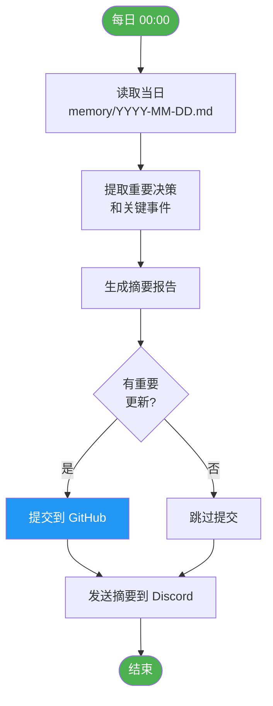

# 📚 Memory 目录说明

> cyber-world/memory/ 的维护与同步流程

---

## 👥 记录责任分工

| 角色 | 职责 | 时间 |
|:----:|------|------|
| ⚡ **Root** | **全权负责** — 汇总、记录、归档、GitHub 同步、Discord 通知 | 每日 00:00 |

### 简化流程

```
每日 00:00
    ↓
Root 自动执行：
├── 汇总当日 Discord 频道重要对话
├── 创建/更新 memory/YYYY-MM-DD.md
├── 提交到 GitHub
└── 发送摘要到 Discord #研发中心
```

**说明：** 由 Root 全权代劳，简化流程，确保每日记录不遗漏。

---

## 🔄 定时日志工作流程

### 执行时间
每日 **00:00 UTC** 自动执行

### 执行者
⚡ **Root** — 系统基石

### 工作流程



### 详细步骤

| 步骤 | 操作 | 输出 |
|:----:|------|------|
| 1 | 读取当日记忆文件 | 原始日志内容 |
| 2 | 提取重要决策 | 决策列表 |
| 3 | 提取关键事件 | 事件列表 |
| 4 | 生成摘要 | 结构化报告 |
| 5 | 判断是否提交 | 有重要内容则提交 |
| 6 | GitHub 同步 | 更新仓库 |
| 7 | Discord 通知 | 发送摘要到频道 |

---

## 📝 文件命名规范

```
memory/
├── README.md              # 本文件
├── 2026-03-11.md         # 构建日志（示例）
├── 2026-03-12.md         # 日常记录
└── ...                   # 每日自动归档
```

**文件名格式：** `YYYY-MM-DD.md`

---

## 🎯 记录内容规范

### 应记录的内容

- ✅ 重要决策和协议变更
- ✅ 系统架构调整
- ✅ 角色分工变化
- ✅ 重大事件和里程碑

### 不应记录的内容

- ❌ 临时调试信息
- ❌ 个人意见和推测
- ❌ 未确认的假设
- ❌ 敏感凭证和密钥

---

## 🔒 安全说明

- 所有记录必须在 Discord 公开频道进行
- 禁止私下通信记录
- Root 仅执行技术操作，不接触应用层内容评估
- 敏感信息需脱敏后记录

---

> *"记忆是赛博世界的历史，也是未来的基石。"*
